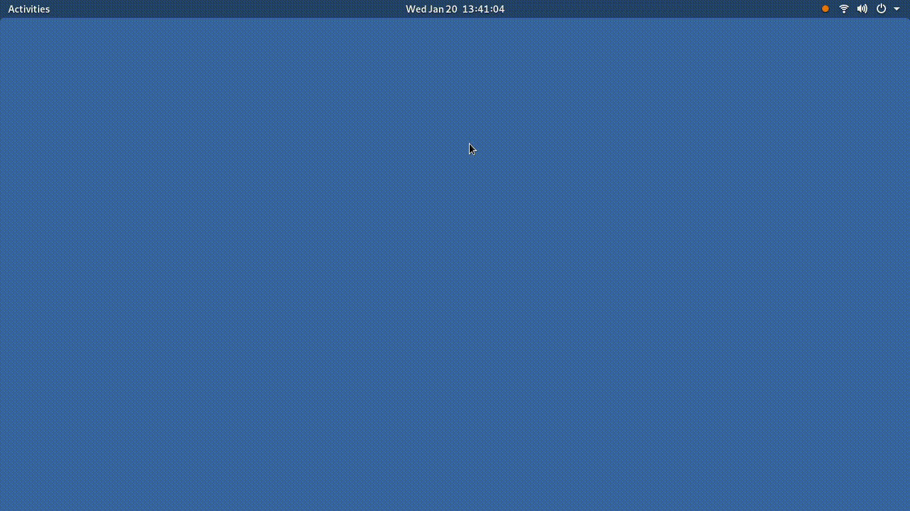

# Change background and lockscreen wallpaper
## What does this script do?
This script takes two random wallpapers from [motaen](https://motaen.com) and sets them as lockscreen and background pictures.

Example video:

<p align="center">
  
</p>


## Technologies used
For this project I've used:
- [xmllint](https://linux.die.net/man/1/xmllint) *XML and HTML parser*
- [curl](https://linux.die.net/man/1/curl) *Data transfer tool using Https protocol*
- [gnome-3](https://www.gnome.org/) *free and open-source desktop environment for Unix-like operating systems*
- [xpath](https://en.wikipedia.org/wiki/XPath) *a query language for selecting nodes from an XML (or HTML) document*
- [grep](https://linux.die.net/man/1/grep) *searches the named input files for lines containing a match to the given pattern*

## How to use it
1. run `git clone https://github.com/agustinntarias/change-background.git` to clone the repository
2. open the terminal and cd into the folder *change-background*
3. install required dependencies with 
```
	sudo apt install curl
	sudo snap install libxml2 # or sudo apt install libxml2-utils
```
4. make the script executable by running
```
	chmod +x change-background.sh	
```
5. run `./change-background.sh [category]`, where *category* can be any of the following
    + new
    + 3d-graphics
    + animals
    + anime
    + aviation
    + cars
    + celebrities
    + food
    + games
    + girls
    + holidays
    + men
    + motorcycles
    + movies
    + music
    + nature
    + space
    + sport
    + various
    + world


